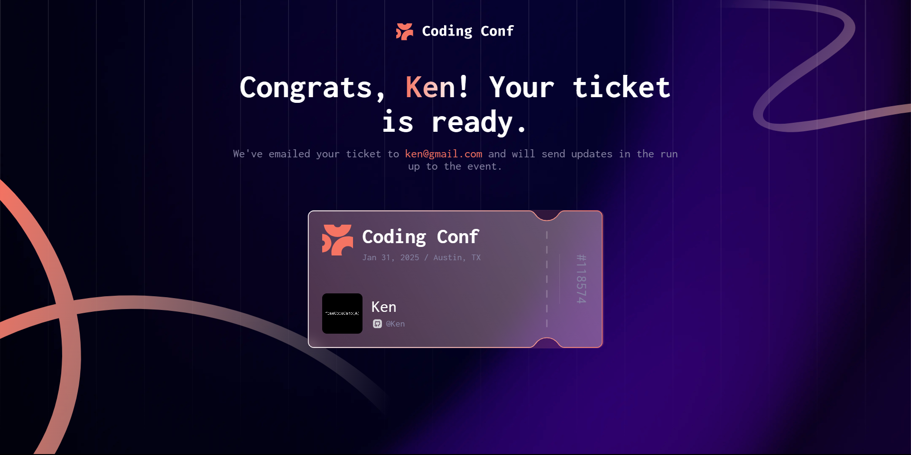

# Conference Ticket Generator



## Selamat Datang! 👋

Terima kasih telah melihat proyek generator tiket konferensi ini. Proyek ini dibuat menggunakan React dan Vite untuk memberikan pengalaman yang modern dan responsif.

## Fitur

Pengguna dapat:

- Mengisi formulir dengan detail mereka
- Menerima pesan validasi form jika:
  - Ada field yang kosong
  - Format email tidak sesuai
  - Upload avatar terlalu besar atau format gambar tidak sesuai
- Mengisi formulir hanya menggunakan keyboard
- Mendapatkan pengumuman input, petunjuk field form, dan pesan error melalui screen reader
- Melihat tiket konferensi yang dihasilkan setelah berhasil mengirim form
- Melihat tata letak optimal sesuai dengan ukuran layar perangkat
- Melihat state hover dan focus untuk semua elemen interaktif

## Teknologi yang Digunakan

- [React](https://reactjs.org/) - Library JavaScript
- [Vite](https://vitejs.dev/) - Build tool
- CSS Custom Properties
- Flexbox
- CSS Grid
- Mobile-first workflow

## Cara Menjalankan Proyek

1. Clone repository ini
2. Install dependencies:

```bash
npm install
# atau
pnpm install
```

3. Jalankan development server:

```bash
npm run dev
# atau
pnpm dev
```

4. Buka [http://localhost:5173](http://localhost:5173) di browser Anda

## Build untuk Production

Untuk membuat versi production:

```bash
npm run build
# atau
pnpm build
```

## Pengembangan Lebih Lanjut

Beberapa area yang bisa dikembangkan lebih lanjut:

- Menambahkan animasi transisi yang lebih halus
- Implementasi dark mode
- Menambahkan fitur share tiket ke media sosial
- Optimasi performa loading gambar
- Menambahkan unit testing

## Penulis

- Website - [Wahyu Ananda](https://github.com/wahyuanandaa)
- GitHub - [@wahyuanandaa](https://github.com/wahyuanandaa)

## Lisensi

Proyek ini dilisensikan di bawah [MIT License](LICENSE).
